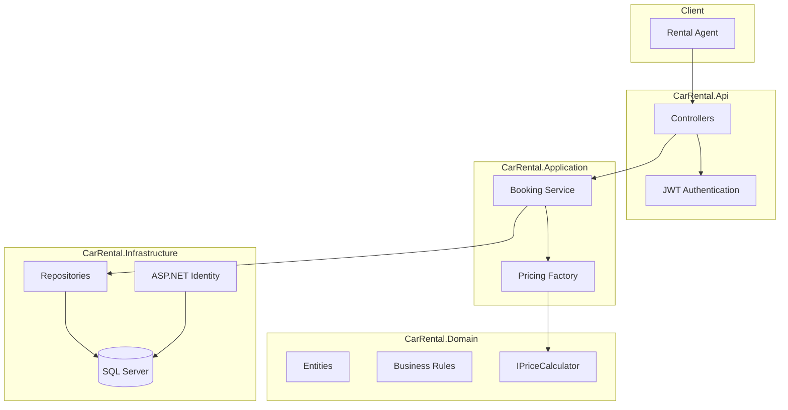
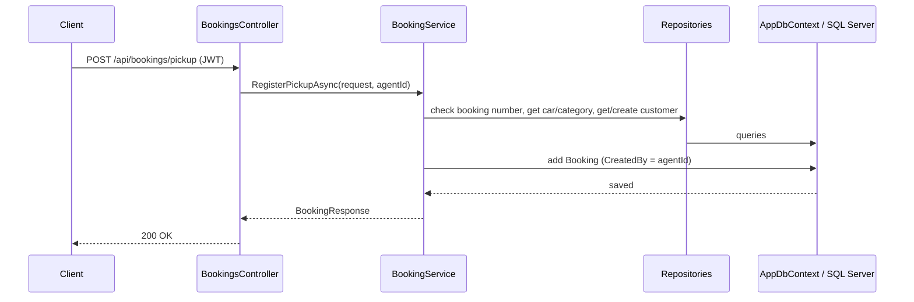
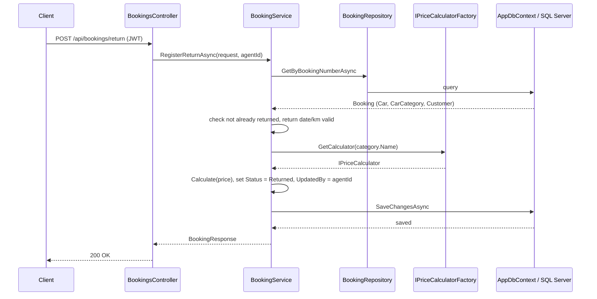

# Architecture

## High-level overview

## Request flow — register pickup

Return follows the same shape, but also resolves the right IPriceCalculator
for the car's category.

## Request flow — register return

## Persistence

EF Core migrations apply automatically on startup (<b>Database.Migrate()</b>` in program.cs, so there's no manual database setup step. Seed data creates the
three car categories and one demo car per category, no api to create.

## Auth

ASP.NET Core Identity handles users/roles/password hashing; login returns a
JWT with the user's roles baked in as claims. [Authorize(Roles = "Agent,Manager")]
protects the booking endpoints
