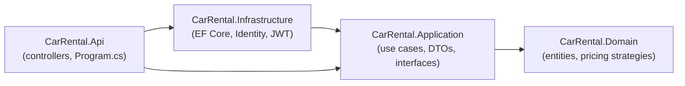
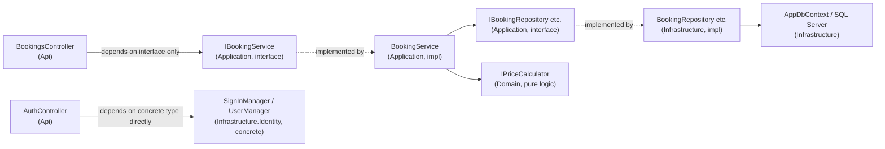
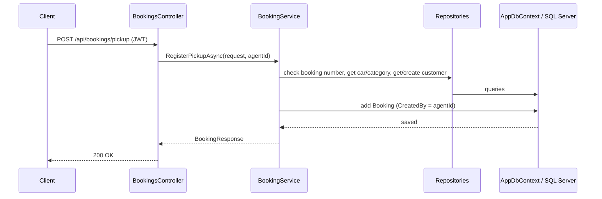
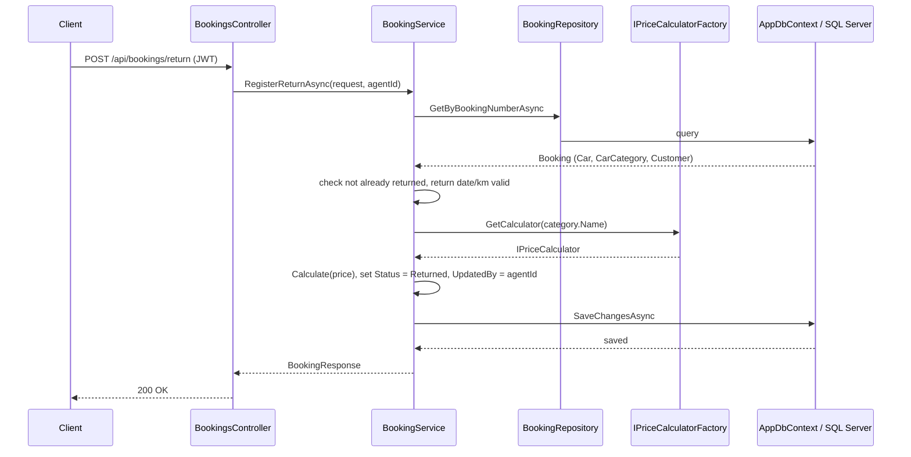

# Architecture

Clean Architecture, four projects, dependencies only point inward.

- **Domain** has no dependencies at all — entities, enums, and the pricing strategies
  (`IPriceCalculator` + Small/Combi/Truck). Pure logic, no EF Core, no ASP.NET.
- **Application** defines the use cases (`IBookingService`) and the interfaces
  Infrastructure has to implement (`IBookingRepository`, `ITokenService`, ...).
- **Infrastructure** implements those interfaces: `AppDbContext`, repositories,
  ASP.NET Core Identity, JWT token generation.
- **Api** is the composition root — it's the only project allowed to know about
  both Application and Infrastructure, because `Program.cs` has to wire the
  concrete implementations into the DI container. Controllers themselves should
  only depend on Application interfaces (`BookingsController` does this correctly
  via `IBookingService`; `AuthController` is the one exception — it uses ASP.NET
  Identity's `SignInManager`/`UserManager` directly, a pragmatic shortcut rather
  than adding another abstraction layer for a small codebase).

## Two paths through Api — and why they're different

`BookingsController` and `AuthController` don't depend on the lower layers the
same way. Worth knowing cold, because it's the natural "explain a trade-off you
made" question.

- **`BookingsController` → `IBookingService`.** The controller has never heard
  of EF Core, repositories, or `AppDbContext`. It could be tested, or have its
  implementation swapped, without touching the controller at all. This is the
  "textbook" path.
- **`AuthController` → `SignInManager<ApplicationUser>` / `UserManager<ApplicationUser>`
  directly**, from `CarRental.Infrastructure.Identity`. No Application-layer
  interface sits in between, unlike `IBookingService`.

### The trade-off, in an interview answer

> "I didn't add an `IAuthService` abstraction for login the way I did for
> bookings, because `SignInManager`/`UserManager` already *are* a well-tested
> abstraction — ASP.NET Core Identity's whole job is to hide password hashing,
> lockout, and the user store behind those two classes. Wrapping them in
> another interface would mostly just forward calls one-for-one, for a
> codebase with one controller and no plan to swap auth providers. I'd do it
> if this were a bigger system, or if Application needed to stay testable
> without any ASP.NET Core package at all — but here it's a deliberate
> 'not every dependency needs its own interface' call, not an oversight."

The one thing this trade-off actually costs: `CarRental.Application` normally
never needs to know ASP.NET Core Identity exists (see `ITokenService` taking
`IAuthenticatedUser`, not `ApplicationUser` — that abstraction *was* added,
specifically so `TokenService`'s caller in Application stays decoupled). Login
itself just never got the same treatment, since `AuthController` lives in Api
either way, and Api is already allowed to reference Infrastructure.

## Request flow — register pickup

Return follows the same shape, but also resolves the right `IPriceCalculator`
for the car's category and stamps `UpdatedBy`.

## Request flow — register return

## Persistence

EF Core migrations apply automatically on startup (`Database.Migrate()` in
`Program.cs`), so there's no manual database setup step. Seed data creates the
three car categories and one demo car per category, since there's no API to
create either.

## Auth

ASP.NET Core Identity handles users/roles/password hashing; login returns a
JWT with the user's roles baked in as claims. `[Authorize(Roles = "Agent,Manager")]`
protects the booking endpoints — no server-side session, the token is the session.
